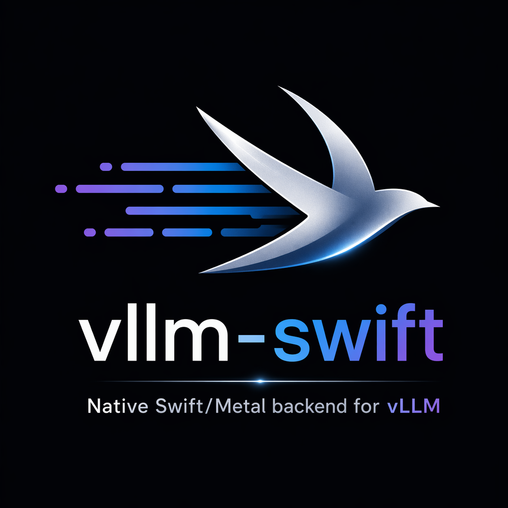

<p align="center">
  
</p>

<p align="center">
  A native Swift/Metal backend for <a href="https://github.com/vllm-project/vllm">vLLM</a> on Apple Silicon.<br>
  <b>No Python in the inference hot path.</b>
</p>

## Quick Start

### 1. Install

```bash
brew tap TheTom/tap && brew install vllm-swift
```

Or from source:

```bash
git clone https://github.com/TheTom/vllm-swift.git && cd vllm-swift
./scripts/install.sh
```

### 2. Run

```bash
vllm-swift download mlx-community/Qwen3-4B-4bit
vllm-swift serve ~/models/Qwen3-4B-4bit --max-model-len 2048
```

Server running at `http://localhost:8000` (OpenAI-compatible API).

> Drop-in replacement for vLLM on Apple Silicon. All `vllm serve` flags work unchanged.

## Performance (M5 Max 128GB)

Up to 2.4x higher throughput at low concurrency by removing Python from the inference hot path.

Decode output tok/s. Prompt=18 tokens, generation=50 tokens (short-context decode benchmark), greedy.

> Both measured via offline benchmark (no HTTP overhead). **vllm-swift** uses the Swift/Metal engine via ctypes. **vllm-metal** uses the Python/MLX engine via vLLM's offline API.

### Qwen3-0.6B

| | Single | 8 concurrent | 32 concurrent | 64 concurrent |
|---|:---:|:---:|:---:|:---:|
| **vllm-swift** | **340** | **1,512** | **2,862** | **3,383** |
| vllm-metal (Python/MLX) | 142 | 1,170 | 2,457 | 3,017 |

### Qwen3-4B

| | Single | 8 concurrent | 32 concurrent | 64 concurrent |
|---|:---:|:---:|:---:|:---:|
| **vllm-swift** | **149** | **479** | **1,166** | **1,519** |
| vllm-metal (Python/MLX) | 105 | 408 | 1,067 | 1,387 |

### [TurboQuant+](https://github.com/TheTom/turboquant_plus) KV Cache Compression

[TurboQuant+](https://github.com/TheTom/turboquant_plus) enables longer context by compressing KV cache with no measurable impact on throughput.

**Qwen3.5 2B (4-bit weights)**

| KV Cache | Compression | PPL @1K | PPL @32K | Prefill @1K | Prefill @32K | Decode @1K | Decode @32K |
|----------|:-----------:|:------:|:-------:|:----------:|:-----------:|:----------:|:-----------:|
| FP16 | 1.0x | 2.72 | 4.40 | 11,173 tok/s | 6,903 tok/s | 264 tok/s | 157 tok/s |
| turbo4v2 | 3.2x | 3.22 | 3.72 | 11,298 tok/s | 6,916 tok/s | 265 tok/s | 157 tok/s |
| turbo3 | 4.6x | 3.95 | 3.89 | 11,348 tok/s | 6,958 tok/s | 264 tok/s | 157 tok/s |

## Architecture

The entire forward pass runs in Swift/Metal. Python is used only for orchestration.

```
Python (vLLM API, tokenization, scheduling)  ← github.com/vllm-project/vllm
  ↓ ctypes FFI
C bridge (bridge.h)
  ↓ @_cdecl
Swift (mlx-swift-lm, BatchedKVCache, batched decode)
  ↓
Metal GPU
```

## Features

- OpenAI-compatible API (`/v1/completions`, `/v1/chat/completions`)
- Streaming (SSE) responses
- Chat templates (applied by vLLM, model-specific)
- Batched concurrent decode with `BatchedKVCache` (fully batched projections + attention)
- Per-request temperature sampling in batched path
- Auto model download from HuggingFace Hub
- [TurboQuant+](https://github.com/TheTom/turboquant_plus) KV cache compression (`turbo3`, `turbo4v2`) via mlx-swift-lm
- Decode and prompt logprobs
- Greedy and temperature sampling
- EOS / stop token detection (vLLM scheduler)
- VLM (vision-language model) support (experimental)
- Works with [Hermes](https://github.com/nousresearch/hermes-agent), [OpenCode](https://github.com/anomalyco/opencode), and any OpenAI-compatible client

## Use with AI tools

```bash
# Start server with tool calling enabled
vllm-swift serve ~/models/Qwen3-4B-4bit --max-model-len 40960 \
  --served-model-name qwen3-4b \
  --enable-auto-tool-choice --tool-call-parser hermes
```

Then point your tool at it:

```bash
# Hermes — set in ~/.hermes/config.yaml:
#   base_url: http://localhost:8000/v1
#   model: qwen3-4b

# OpenCode
OPENAI_API_BASE=http://localhost:8000/v1 OPENAI_API_KEY=local opencode

# Any OpenAI-compatible client
curl http://localhost:8000/v1/chat/completions \
  -H "Content-Type: application/json" \
  -d '{"model":"qwen3-4b","messages":[{"role":"user","content":"Hello"}]}'
```

## Configuration

`vllm-swift serve` is a thin wrapper around `vllm serve` — all standard vLLM flags work. Here are the common setups:

### Basic serving

```bash
vllm-swift serve ~/models/Qwen3-4B-4bit \
  --served-model-name qwen3-4b \
  --max-model-len 40960
```

### Agent / tool calling (Hermes, OpenCode, etc.)

```bash
vllm-swift serve ~/models/Qwen3-4B-4bit \
  --served-model-name qwen3-4b \
  --max-model-len 40960 \
  --enable-auto-tool-choice --tool-call-parser hermes
```

### Chain-of-thought models (strip `<think>` tags)

```bash
vllm-swift serve ~/models/Qwen3-4B-4bit \
  --served-model-name qwen3-4b \
  --max-model-len 40960 \
  --enable-reasoning --reasoning-parser deepseek_r1
```

### Long context with [TurboQuant+](https://github.com/TheTom/turboquant_plus)

Compress KV cache 3-5x to fit longer context with no measurable impact on throughput:

```bash
vllm-swift serve ~/models/Qwen3-4B-4bit \
  --served-model-name qwen3-4b \
  --max-model-len 40960 \
  --additional-config '{"kv_scheme": "turbo4v2", "kv_bits": 4}'
```

| Scheme | Compression | Best for |
|--------|:-----------:|----------|
| `turbo4v2` | 3.2x | Recommended — best quality/compression balance |
| `turbo3` | 4.6x | Maximum compression, higher PPL trade-off |

### Full setup (agent + reasoning + TurboQuant+)

```bash
vllm-swift serve ~/models/Qwen3-4B-4bit \
  --served-model-name qwen3-4b \
  --max-model-len 40960 \
  --enable-auto-tool-choice --tool-call-parser hermes \
  --enable-reasoning --reasoning-parser deepseek_r1 \
  --additional-config '{"kv_scheme": "turbo4v2", "kv_bits": 4}'
```

### All flags

```bash
vllm-swift serve <model> [options]

  --served-model-name NAME   Clean model name for API clients (recommended)
  --max-model-len N          Max sequence length (default: model config)
  --port PORT                API server port (default: 8000)
  --gpu-memory-utilization F Memory fraction 0.0-1.0 (default: 0.9)
  --dtype float16            Model dtype (default: float16)
  --enable-auto-tool-choice  Enable tool/function calling
  --tool-call-parser NAME    Tool call format (hermes, llama3, mistral, etc.)
  --enable-reasoning         Enable chain-of-thought parsing
  --reasoning-parser NAME    Reasoning format (deepseek_r1, etc.)
  --additional-config JSON   Extra config (kv_scheme, kv_bits)
```

All standard [vLLM flags](https://docs.vllm.ai/en/latest/serving/openai_compatible_server.html) work — these are just the most common ones.

## Known Limitations (early development)

- **LoRA** not supported (Swift engine limitation)
- **Chunked prefill** disabled (Swift engine handles full sequences)
- **top_p sampling** not supported in batched decode path (temperature works)
- Only **Qwen3** models use the fully batched decode path; other architectures fall back to sequential decode (still functional, just slower at high concurrency)
- Requires macOS on Apple Silicon (no Linux/CUDA)

## Install

### Homebrew

```bash
brew tap TheTom/tap && brew install vllm-swift
```

Prebuilt bottle — no Swift toolchain needed. First run of `vllm-swift serve` sets up a managed Python environment automatically.

### From source

```bash
git clone https://github.com/TheTom/vllm-swift.git
cd vllm-swift
./scripts/install.sh
source activate.sh
vllm serve ~/models/Qwen3-4B-4bit --max-model-len 2048
```

### Manual (full control)

```bash
git clone https://github.com/TheTom/vllm-swift.git && cd vllm-swift
cd swift && swift build -c release && cd ..
pip install -e .
DYLD_LIBRARY_PATH=swift/.build/arm64-apple-macosx/release \
  vllm serve ~/models/Qwen3-4B-4bit --max-model-len 2048
```

### Download a model

```bash
vllm-swift download mlx-community/Qwen3-4B-4bit

# Or manually:
huggingface-cli download mlx-community/Qwen3-4B-4bit --local-dir ~/models/Qwen3-4B-4bit
```

## Project Structure

```
vllm_swift/           Python plugin (vLLM WorkerBase)
swift/
  Sources/VLLMBridge/       C bridge (@_cdecl exports)
  bridge.h                  C API (prefill, decode, batched decode)
scripts/
  install.sh                One-step build + install
  build_bottle.sh           Build + upload Homebrew bottle
  integration_test.sh       End-to-end smoke test
homebrew/
  vllm-swift.rb             Homebrew formula
tests/                      84 tests, 97% coverage
```

## Requirements

- macOS 14+ on Apple Silicon
- Xcode 15+ or Swift 6.0+ (for building from source; Homebrew bottle skips this)
- Python 3.10+
- [vLLM](https://github.com/vllm-project/vllm) 0.19+
- [mlx-swift-lm](https://github.com/TheTom/mlx-swift-lm/tree/vllm-swift-stable) (pulled automatically by Swift Package Manager)

## License

Apache-2.0
